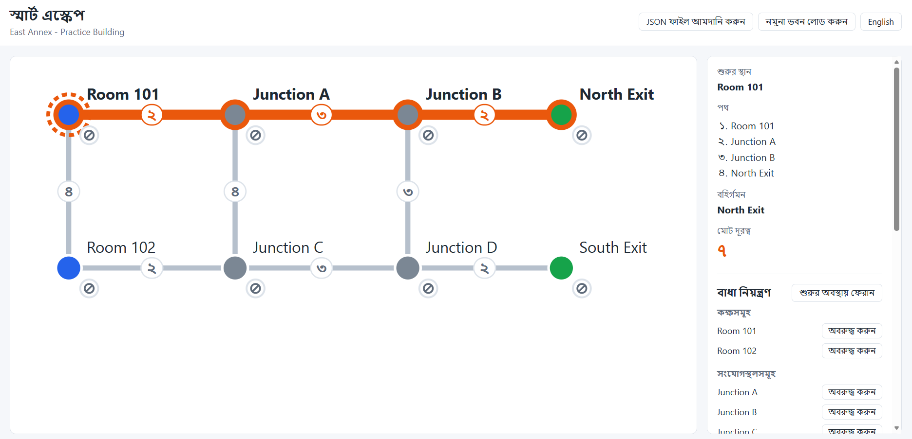
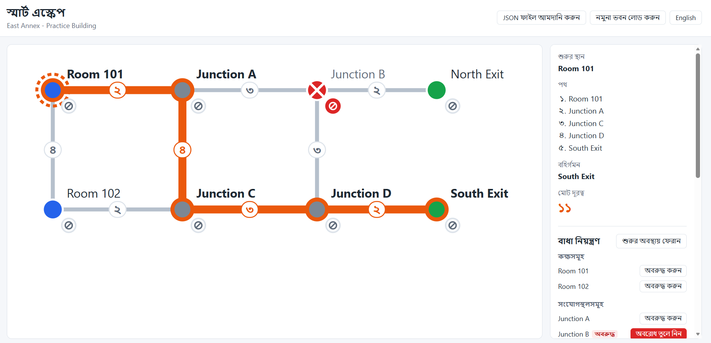

# Smart Escape

A bilingual (Bangla / English) web app that draws a building's floor graph and finds the cheapest route from a chosen location to an open exit, recalculating instantly as rooms, junctions, corridors and exits are blocked or closed.

## Participant

- **Name:** Asma-Ul-Husna Oishee
- **Registration number:** `<REGISTRATION NUMBER>`

## Live link

https://mocktestvibecoding.netlify.app

## How to run

Requires Node.js and npm.

```bash
npm install
```

```bash
npm run dev
```

Starts the dev server (by default at http://localhost:5173).

```bash
npm run build
```

Writes a production build to `dist/`.

## Implemented features

| Task | What the app does |
| --- | --- |
| Load the building dataset | The bundled practice building (`building.json`, mirrored in `src/data.js`) is drawn as soon as the app opens. |
| Hand-drawn SVG map | Every corridor is a line between its two nodes with its cost on a small chip at the midpoint; every node is a circle with its label beside it, coloured by type (room blue, junction grey, exit green). The viewBox is computed from the nodes' min/max coordinates, so any dataset fits, and the SVG scales to its container. No graph library. |
| Choose a start location | Clicking (or pressing Enter/Space on) any unblocked room or junction makes it the start; it gets a dashed ring. Exits and blocked nodes cannot be chosen. |
| Shortest route to an exit | `src/routing.js` runs Dijkstra and returns the route, the exit and the total cost. The route is drawn as thicker orange lines with highlighted nodes, and the side panel lists the node sequence, exit and total cost. Status messages are shown for "select a starting location", "starting location blocked" and "no route available". |
| Hazards: block / unblock / close / reopen | Each room and junction has a small block button beside it on the map (separate from the start click); clicking a corridor line or its cost chip blocks it; exits can be closed from their button or by clicking the exit. The same actions are available as buttons in the side panel, grouped under Rooms, Junctions, Exits and Corridors. Blocked nodes are red with a cross, blocked corridors are dashed and faded (chip too), closed exits are grey with a slash. A legend explains every state. |
| Live recalculation and Reset | The route recalculates on every hazard change with no reload. Reset restores the hazards to the loaded file's `initial_state`, keeping the selected start and language. |
| JSON import with validation | "Import JSON" in the header reads a file, parses it and validates every rule (building name; node IDs, labels, types and coordinates; edge IDs, endpoints and positive-integer costs; no self-loops or repeated node pairs; at least one room/junction and one exit; 2–60 nodes and 1–150 edges; `initial_state` lists with IDs of the right category). All problems are listed at once in a translated error panel and the current building is left untouched. A valid file replaces the building, applies its `initial_state`, clears the start and shows a short success message. Disconnected graphs are accepted. "Load sample building" restores the bundled sample. |
| Bangla / English | Every interface string comes from `src/i18n.js` with `bn` and `en` entries. One toggle switches language; the choice is saved in `localStorage` and restored on load. In Bangla mode, costs, counts and route step numbers use Bangla digits. Dataset labels (e.g. "Room 101") are shown as written in the file. |
| Animations | The start ring fades and eases in; route, block and unblock changes animate stroke colour, width, dash and opacity over 200 ms; the error/success banner slides in. All transitions are under 300 ms, none loop, and all are turned off when `prefers-reduced-motion` is set. |

## Routing rules

- Corridors are undirected. Route cost is the **sum of corridor costs only** — never distance on screen or the number of corridors.
- Blocked nodes (and every corridor touching them), blocked corridors and closed exits are removed from the graph entirely, including as intermediate stops.
- If the start is blocked the result is "starting location blocked"; if no open exit can be reached it is "no route available".
- Among reachable open exits the lowest total cost wins. On a cost tie, the exit with the lexicographically smallest ID wins.
- If several paths reach the same node at equal cost, the one whose node-ID sequence is lexicographically smaller (compared element by element as strings) is kept — a tie never overwrites the stored path. Example: on the sample with Junction B (C2) blocked, starting at Room 101, C3 is reached at cost 6 via both C1 and R2; R1‑C1‑C3 is kept, giving R1‑C1‑C3‑C4‑E2 at cost 11.

## Known issues

- **Live link is not public.** At the time of writing, the Netlify URL redirects to Netlify's "Team protection" login page, so visitors without access to the Netlify team cannot open the app.
- **No automated tests.** Routing and validation were checked with one-off scripts and manual testing in the browser; there is no test suite in the repository.
- **Label and control placement is fixed.** Node labels sit above-right of each node and the block button below-right. On datasets with dense nodes or diagonal corridors these can overlap lines or each other, and very long labels may run past the map edge (the right padding is fixed).
- **No zoom or pan.** A large building (up to 60 nodes) is scaled down to fit, so labels and the small map buttons can become hard to read and tap, especially on phones.
- **Imported data is not saved.** Only the language choice is remembered; reloading the page returns to the sample building with its initial hazards.
- **Raw values in error messages.** When a file is rejected, values copied from it (for example a cost of `1.5`) are shown exactly as written, so they appear in Western digits even in Bangla mode.
- **Bangla font depends on the system.** No font is bundled; the CSS asks for Noto Sans Bengali, Hind Siliguri, SolaimanLipi, Nirmala UI or Vrinda, so rendering varies by device.

## AI tools used

- Claude Code

## Most useful prompt

The routing engine prompt:

> Create `src/routing.js` exporting `findRoute(graph, hazards, startId)`.
> Rules, follow exactly:
>
> * Treat all edges as undirected.
> * Exclude blocked nodes entirely, including as intermediate nodes, and every edge touching them. Exclude blocked edges. Exclude closed exits both as destinations and as intermediate nodes.
> * If `startId` is in `blocked_nodes`, return `{ status: 'START_BLOCKED' }`.
> * Run Dijkstra from the start. Route cost is the sum of edge costs only — never coordinates, never the number of corridors.
> * Among all reachable exits that are not closed, choose the minimum total cost. On a cost tie, choose the lexicographically smallest exit ID. If paths to that exit also tie on cost, choose the lexicographically smallest sequence of node IDs — compare the path arrays element by element as strings.
> * If no open exit is reachable, return `{ status: 'NO_ROUTE' }`.
> * Otherwise return `{ status: 'OK', path: [...nodeIds], exit, cost }`.
>
> Critical tie-break detail: when two paths reach the same node at equal cost, do not overwrite with `<=`. Use strict `<` for a better cost, and on an exact cost tie compare the two candidate paths element by element as strings and keep the lexicographically smaller one. Verify with this case: on the sample graph with C2 blocked, starting at R1, node C3 is reachable at cost 6 via both C1 and R2 — the correct stored path is R1-C1-C3, giving a final route R1-C1-C3-C4-E2 at cost 11.
> Do not hardcode anything from the sample dataset. The function must work on any graph with the same schema.
> Then wire it into the app:
>
> * Clicking an unblocked room or junction on the map sets it as `start`, with a clear visual highlight.
> * Highlight the returned path in the SVG: thicker coloured lines on the route edges, highlighted route nodes.
> * Create `src/components/RoutePanel.jsx` in the right-hand side panel showing the node sequence, the exit and the total cost, all labelled from i18n.
> * On `START_BLOCKED` show the "Starting location blocked" message; on `NO_ROUTE` show "No route available"; before any start is chosen show "Select a starting location".
>
> Follow CLAUDE.md.

## Screenshots



*Baseline — no hazards. Start Room 101 → Junction A → Junction B → North Exit, total cost 7.*



*After Junction B (C2) is blocked — the route switches to Room 101 → Junction A → Junction C → Junction D → South Exit, total cost 11.*

## License

MIT — see [LICENSE](LICENSE).
